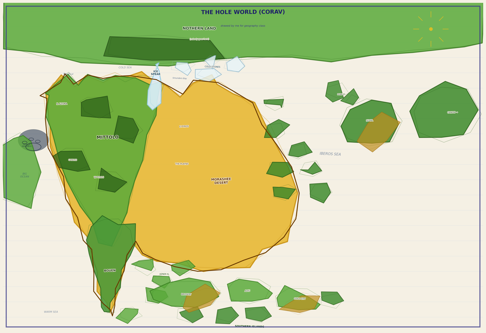

# Azhora

Azhora is a worldbuilding repository for the fictional world of Corav, centered on the continent of Azhora. It combines Markdown lore files with a small Python CLI for loading, browsing, and searching the setting.

The project currently has two main tracks:

- `lore/`: canonical world documents with YAML frontmatter.
- `azhora/` and `main.py`: Python helpers and a command-line interface for navigating the lore.

There is also a map-generation script, `generate_map.py`, which produces a childlike in-world map image, `azhora_map.png`.



## Project Status

The lore is organized in layers. Geography and major language-family documents are the most developed areas right now. Peoples, cultures, institutions, history, artifacts, and open mysteries are mapped out in `ROADMAP.md` and are intended to grow as separate entries.

At a glance:

- Geography: mostly complete, including Corav, Azhora, regional entries, nearby continents, and major phenomena.
- Languages: overview plus major conlang family documents.
- Peoples and cultures: planned as standalone documents.
- Institutions and history: referenced in lore, planned for future entries.
- Artifacts: started with the schoolchild map collection.
- App tooling: basic lore loading, listing, showing, and searching are implemented.

## Repository Layout

```text
.
+-- azhora/
|   +-- __init__.py
|   +-- loader.py        # Markdown + YAML frontmatter loader
|   +-- models.py        # LoreEntry dataclass
+-- lore/
|   +-- artifacts/
|   +-- geography/
|   +-- peoples/
+-- generate_map.py      # Creates azhora_map.png
+-- main.py              # CLI entry point
+-- requirements.txt
+-- ROADMAP.md
```

## Setup

Create and activate a virtual environment if you want to keep dependencies local:

```powershell
python -m venv .venv
.\.venv\Scripts\Activate.ps1
python -m pip install -r requirements.txt
```

The CLI currently only requires `PyYAML`.

For map generation, also install:

```powershell
python -m pip install matplotlib numpy
```

## CLI Usage

Run commands from the project root:

```powershell
python main.py list
python main.py list geography
python main.py show Corav
python main.py search Pyros
```

Commands:

- `list [category]`: list all lore entries, optionally filtered by category.
- `show <name>`: print a single entry with wrapped body text.
- `search <query>`: search entry names, tags, and body text.

Names are matched either by frontmatter `name` or by the Markdown filename stem.

### Windows UTF-8 Note

Some lore entries use characters outside the default Windows console encoding. If `list` or `search` raises a `UnicodeEncodeError` in PowerShell, run:

```powershell
$env:PYTHONIOENCODING = "utf-8"
python main.py list
```

## Lore File Format

Lore files are Markdown documents under `lore/` with YAML frontmatter at the top:

```markdown
---
name: Corav
category: geography
tags: [world, planet, overview]
status: draft
related: [Azhora]
---

# Corav

Body text goes here.
```

Supported frontmatter fields:

- `name`: display name for the entry.
- `category`: grouping used by `list`.
- `tags`: searchable tags.
- `status`: usually `draft` for current entries.
- `related`: names of connected lore entries.

The loader ignores Markdown files that do not begin with YAML frontmatter.

## Map Generation

To regenerate the schoolchild-style world map:

```powershell
python generate_map.py
```

The script saves `azhora_map.png` in the project root. It uses a fixed random seed for reproducible wobble and crayon effects.

## Development Notes

The app code is intentionally small:

- `LoreEntry.summary()` returns the first non-heading paragraph.
- `load_all()` recursively parses frontmatter-backed Markdown under `lore/`.
- `find()` resolves exact entry names or filename stems.
- `search()` performs simple case-insensitive substring search across names, body text, and tags.

Planned app features are tracked in `ROADMAP.md`, including tag filtering, related-entry graphing, cross-reference checks, and better formatting for language entries.

## Existing Lore Summary

The current lore describes Corav, a partially known world whose recorded geography is filtered almost entirely through Azhoran scholarship. Azhorans know their own continent in detail, the nearby seas reasonably well, and the rest of the planet only through fragments, horizon sightings, expedition reports, oral traditions, disputed maps, and the occasional uncomfortable anomaly. Corav has two moons, Sova and Vel, and the returning Ember Comet serves as a generational marker in Azhoran timekeeping. The setting's central tension is not simply that the world is mysterious, but that Azhoran institutions keep encountering evidence that their maps, histories, and categories are incomplete.

Azhora itself is the main continent and the cultural center of the existing documents. It runs roughly north to south, broad in the central-northern portion and tapering into the cold southern peninsula of Bouen. Its climate is shaped by western sea winds, interior ridges, rain shadows, and powerful ocean currents. Western and central Azhora are wet, forested, and river-rich; the eastern interior is dry enough to form the Moroshe Desert; the north is cold and maritime; and the far south is unexpectedly grey, foggy, and cold because of the Deep River current rising from southern waters. The continent is divided into a set of major regions whose cultures grow directly from their terrain.

Mittolo is the green heartland: forested, fertile, river-bound, and politically dominant. Its great rivers, the Velm, Caeras, and Ond, made transport, agriculture, and central institutions possible. Much of what later generations call Azhoran civilization began here: writing, calendars, weights, scholarship, and the political compacts that still define formal governance. Yet Mittolo is not presented as a clean origin point. Its forests contain Dark Groves that seem larger from within than from without, and its oldest traditions remember the First Silence, a pre-written rupture described not as conquest but as departure: "the people before us left." Mittolo is both center and successor, secure in its importance but shadowed by something older.

Northern Azhora is colder, poorer, more maritime, and more independent. The Bay of Lol and Smunders Bay anchor its coast, while the Ganoss uplands and Orched Hills form the inland transition toward Mittolo. Its people were once raiders and became traders over several centuries, not through a single defeat but through shifting economics and mutual exhaustion. Northern shipbuilding and open-water knowledge are highly respected. The Ganoss upland clans remain culturally distinct and only loosely incorporated into coastal or Mittoli systems. The north also faces the Northern Continent, and its oral traditions preserve the strongest sense that something ancient and fundamentally other lies across the cold sea.

Pyros is a divided volcanic hinge between wet west and dry east. West Pyros is fertile, terraced, formal, and culturally intense, with Gala as its principal city. East Pyros sits in the rain shadow and functions as a trade corridor between Mittolo, the Iberos Coast, and the desert. The region's identity is rooted in the Fire Memory: a tradition that the land was once awake with intentional fire and now carries that heat in soil, ash, fumaroles, and ritual. Pyrosi history emphasizes endurance under occupation rather than military dominance. The "Pyrosi Method" is to outlast invaders, maintain institutions under the surface, and resume self-rule when pressure passes.

Amod lies south of the Lotharn Mountains in the foothills, a country of terraces, water courts, pass markets, orchards, and descending roads. It is the slope between the old forested mountains and the Pyrosi transit country: mountain goods become southern trade goods in Amodian warehouses, and Lotharn streams become carefully argued irrigation rights in Amodian courts. Its culture prizes maintenance, correct grade, and systems that still work after urgency has gone home.

The Plains form the broad grassland transition between the western forests and the eastern arid lands. They are not empty space between "real" civilizations. They are home to mobile pastoral cultures whose routes, grazing rights, water access, and oral law are old, sophisticated, and difficult for fixed states to understand. The Plains contain Memory Grass sites, places where the land is believed to retain impressions of past events. These sites matter legally, historically, and spiritually. Outsiders often treat Plains knowledge as folklore; Plains law treats land memory as stronger evidence than written records.

The Moroshe Desert dominates the eastern and southern interior. To outsiders it looks like absence, but its own peoples understand it as a complex world of sand seas, gravel plains, canyon country, oases, routes, and inherited warnings. The desert preserves ancient petroglyphs and ruins from a time when the climate was wetter and large-scale construction was possible. The current desert peoples do not claim simple descent from the ruin-builders, and they refuse to use or scavenge those places. Their explanation, when pressed, is that the ruins belong to something else. Nova Homa, also called Thullaath in the desert languages, stands at the meeting of three ancient trade routes and is built partly on older remains.

The Iberos Coast is the eastern maritime world: Mediterranean climate, island chains, merchant cities, layered politics, and constant sea traffic. Nyross is the great harbor city, governed through a complexity of councils, guilds, courts, and hereditary offices that somehow works. Zoth is a smaller information-trade hub at the edge of several routes. The Iberos Sea is sheltered enough to encourage early maritime development, but the further islands remain uncertain. Suval, the Pebbles, the Outer Islands, and the possible landmass called Canon point toward a larger eastern world that Azhoran records have not fully fixed.

Bouen is the southern peninsula, shaped by fog, cold current, fish, and difficult navigation. The Boueni are maritime, practical, and culturally distinct from both Mittolo and the Iberos Coast. Their sailors became the first Azhorans to map southern routes, reach the Azner Shores, contact the Southern Archipelago, and attempt western crossings. Boueni origin traditions say their ancestors came from the sea. The Blue Stones on the western coast, standing stones with undecoded markings and navigational significance, are tied to this mystery. Boueni culture treats home less as a static place than as a return achieved through voyage.

Beyond Azhora, several regions expand the scale of the world. The Northern Continent is visible from northern Azhora and Cold Stones but remains largely unknown. Ice Spear, its southern glaciated peninsula, points toward Azhora across a dangerous channel, and the Cold Stones archipelago serves as the last practical staging ground before the unknown. Academy expeditions have reached Cold Stones and approached Ice Spear, but no Azhoran expedition has gone inland. Northern oral traditions describe the continent as "the place that does not want to be found," a phrase that functions less as metaphor than as a warning about category error.

The Southern Archipelago is a tropical island world south of Bouen, discovered by Boueni sailors about three hundred years ago from the Azhoran perspective. It is not empty, primitive, or newly available. Its peoples have their own civilizations, languages, navigational sciences, trade networks, and political boundaries. They permit Azhoran presence only on their terms. A failed early trading post on Brocerri established that lesson firmly. The archipelago's expert swell navigation and selective openness toward Boueni sailors hint at deeper ties between Boueni substrate vocabulary, southern star names, and archipelago records.

Several world features are deliberately unresolved. The Red Meridian is a band of dense crimson stone running east-west through Azhora and possibly around the entire planet. Its mineral structure is too consistent, too old, and too strange for ordinary geology to explain comfortably. Some exposed sections carry untranslated carvings. Coastal traditions call it "the scar," not because it marks something that happened, but because it prevents something from happening again. The Ascending Peaks are a mountain region where stone rises and remains suspended while water, metal, animals, and people behave normally. The Silence is an oval region of western ocean where no wind blows, birds turn back, sound behaves oddly, and the seafloor appears worked. Engine-assisted vessels can cross it, but some crews return changed, some ships do not return, and a few return empty.

The artifact lore currently centers on the Schoolchild Maps of Corav, an Academy collection of children's memory maps. These maps are valuable not because they are accurate, but because they reveal what geographic ideas circulate beneath formal education. Children consistently enlarge Azhora, simplify the Northern Continent, underrepresent the Southern Archipelago, and sometimes mark The Silence with dark patches or sea creatures. Most importantly, many independent maps place a small western landmass in a consistent position not found on official Academy charts. The Academy has noticed. It has not investigated.

Language is one of the strongest organizing principles of the setting. Azhora has no single tongue, and the existing language documents treat linguistics as cultural history, political evidence, and metaphysics all at once. Standard Mittoli is the prestige language of the heartland, written in the Cael script, with rich vowels, six cases, four noun classes, aspect-marked verbs, and a formal/colloquial word-order split. It is the language of scholarship and administration, but its dominance is also a historical artifact of Mittoli power.

Pyrosi is related to Mittoli through Proto-Western, but it developed around volcanic memory, social register, and latent action. Its grammar requires speakers to mark social relationship through verb prefixes and prosody. The Social register is not cold formality; it is performed welcome. The Elevated register is used for the land, the dead, and those of high standing. Pyrosi also has a latent aspect for things inevitable but not yet expressed, mirroring the idea of volcanic heat sleeping in the soil. Its ritual register, Tallyss, preserves older forms used in Fire Memory rites.

Moreshi, the desert language family, is structurally unrelated to the western languages. It uses the Khat script, a right-to-left abjad, and a triconsonantal root system. Its grammar distinguishes animate and inanimate in culturally revealing ways: springs and oases are treated differently from water in general, and the ritual register treats everything as animate. The Qadimuur register, used around ruins and ancient canyon sites, contains four-consonant roots, verb-final word order, universal animate agreement, and vocabulary with no known source. It may preserve something older than Moreshi, or something that entered Moreshi from the builders of the deep ruins.

Boueni is the most distant living relative of Mittoli, linked through Proto-Western but transformed by nasal vowels, initial stress, maritime grammar, and an unidentified substrate. Its substrate words cluster around deep ocean, swell navigation, southern stars, return, fog, and the unknowable horizon. These words do not describe forests, farms, or deserts. They describe blue-water seafaring. This supports, without proving, the Boueni account that their ancestors came from the sea and may have some deep relation to the Southern Archipelago.

Grassic, or Auwel, is the language family of the Plains and may be the oldest surviving linguistic presence on Azhora. It has no known relatives. Its grammar has no ordinary noun-verb distinction: roots are predicates, so routes, rivers, people, and places are described by what they do. Every predicate requires an evidential suffix marking how the speaker knows the claim. The strongest evidential is land-witness, used when Memory Grass confirms something. Grassic also has caull, knotted cord records that encode legal predicates rather than ordinary speech. Together, Memory Grass, oral tradition, and caull form a legal-historical system that does not fit neatly into Mittoli categories of writing or proof.

Across the lore, Azhora is a world of overlapping valid records: maps, routes, ruins, carvings, songs, scripts, knots, grammar, children's drawings, and places that remember. The big mysteries are intentionally not solved. The western landmass, the ruins in the desert, the Red Meridian carvings, the worked seafloor of the Silence, the source of Boueni substrate words, the antiquity of Grassic, and the nature of the Northern Continent all accumulate evidence without collapsing into explanation. The result is a setting where worldbuilding is less about filling blanks than about deciding which cultures have the authority to name what is already there.
